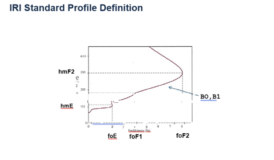
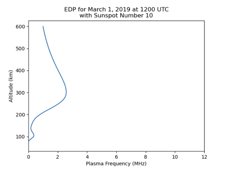

## <ins>Assessment IRI EDP</ins>

Create a C-based modeling and simulation program that drive IRI model Fortran code. The code should capture and generate vertical EDP (Electron Density Profile) for a given time and location of interest.  

- time of interest: Mar 3 2021 UT 11:00:00 and Mar 4, 2021 UT 23:00:00
- location o interest: Lat 37.8N and Lon 75.4W

## <ins>Assessment Criteria</ins>

1. Create a simple Makefile that can compile iri2016 (<http://irimodel.org>) and generate a shared object library
2. Write a C-program that links with the shared object created and create all data needed for step 3)
3. Use gnuplot (<www.gnuplot.info>) or other similar C-based plotting tools to generate plots of EDP parameters using the shared objective created in step 1.
     a. alternatively, use F2PY (<https://www.numfys.net/howto/F2PY/>) and Python to create EDP plots using the shared object created in step 1. (Although C-based plotting is the preferred solution)
4. Furnish instructions/documentation, etc. on how to run the code and lesson/insights learned by doing this exercise.

## <ins>Example EDP plots</ins>

## <ins>Thoughts</ins>
1. More time to learn Fortran
2. Could re-organize the fortran source and extract only the needed functions and subroutines
3. More time to learn Fortran.  :)

## <ins>Dependencies</ins>

| module   | version   | location                                              |
|----------|-----------|-------------------------------------------------------|
| cmake    | 3.28.0    | <https://cmake.org>                                   |
| make     | >= 3.0.0  | <https://www.gnu.org/software/make/>                  |
| gcc-13   | >= 13.0.0 | <https://gcc.gnu.org/>                                |
| gfortran | 13.2.0    | <https://gcc.gnu.org/fortran/>                        |
| gnuplot  | 5.4.10    | <http://www.gnuplot.info/>                            |

## <ins>Quick Start</ins>

1. Clone the repository to your local machine
`git clone https://github.com/krissmi/ERT_Exercise.git`

Once you have a local copy of the repository, you may build the C program/driver:

2. Change to the exercise_1 directory
`cd ERT_Exercise/exercise_1`

3. Build the exercise
`make install`

4. Build artifacts are located in the `$REPOROOT/local` directory.  The C module maybe run with: `$REPOROOT/local/bin/iriedp`.
